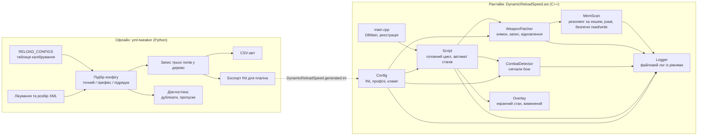
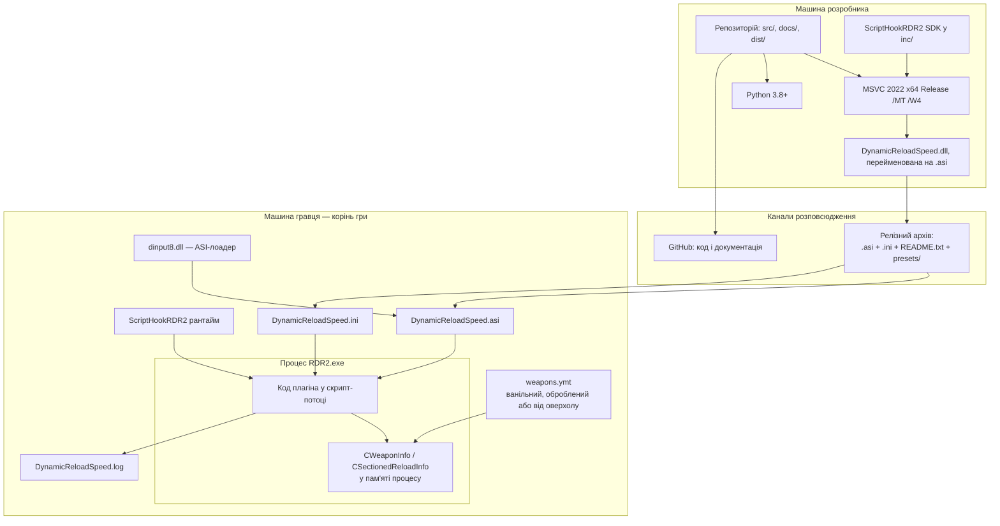
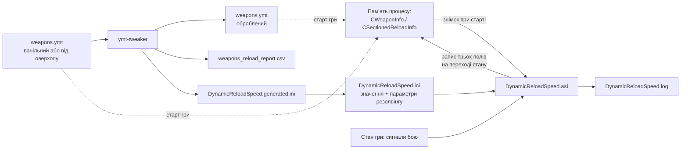
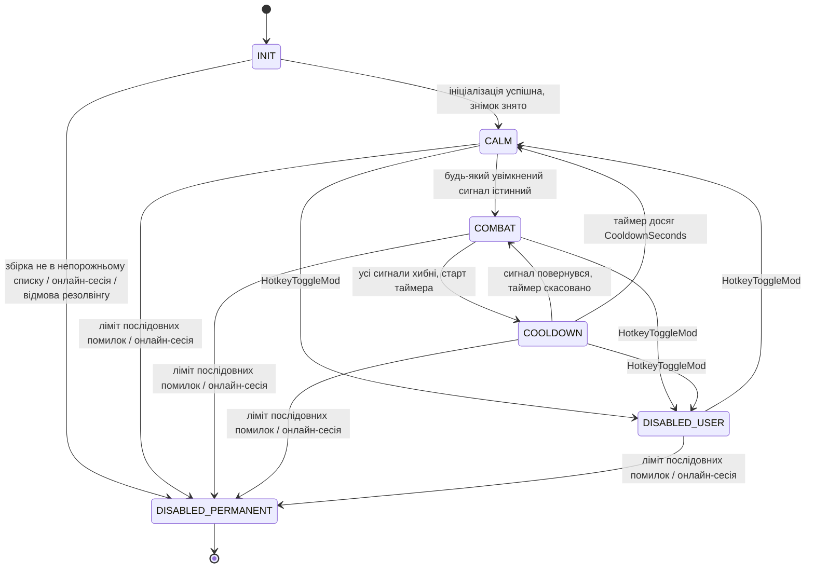
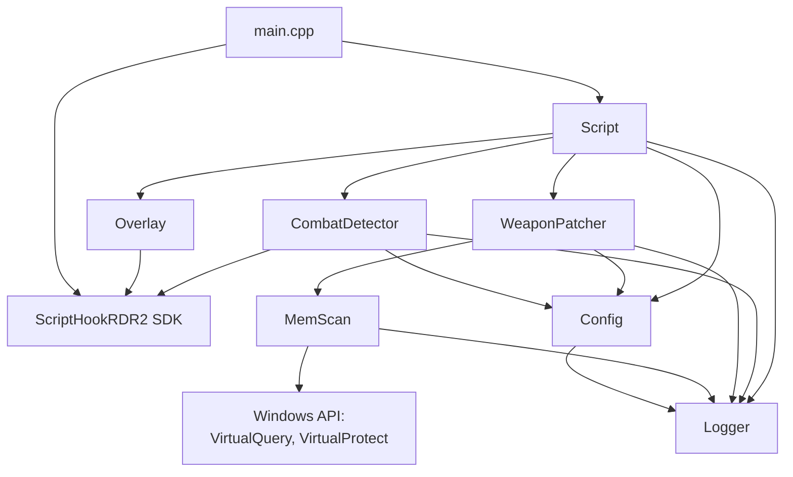

# Опис архітектури — RDR2 Dynamic Reload

| | |
| --- | --- |
| Назва | Опис архітектури — RDR2 Dynamic Reload |
| Версія | 0.2.2 |
| Статус | Draft |
| Останнє оновлення | 2026-09-30 |
| Власник | Данило Перепеляк |
| Пов'язані документи | [`../specification/overview.md`](../specification/overview.md), [`../specification/requirements.md`](../specification/requirements.md), [`dfd.md`](dfd.md), [`../internal_spec/contexts_registry.md`](../internal_spec/contexts_registry.md), [`../policy/project_policy.md`](../policy/project_policy.md) |

## 1. Предмет і межі опису

Документ описує архітектуру системи `RDR2 Dynamic Reload` за ISO/IEC/IEEE 42010: фіксує зацікавлені сторони та їхні інтереси, набір представлень, що ці інтереси адресують, і архітектурні рішення разом із розглянутими альтернативами.

Об'єкт опису — два компоненти одного репозиторію:

- `ymt-tweaker` — офлайн-препроцесор `weapons.ymt` (Python 3.8+, тільки стандартна бібліотека);
- `DynamicReloadSpeed.asi` — рантайм-плагін (C++17/20, x64, MSVC `/MT`, ScriptHookRDR2 SDK).

Архітектура гри, формат RPF-архівів, внутрішня будова ScriptHookRDR2 та інструменти видобування метафайлів до предмета опису не належать і розглядаються як зовнішні обмеження.

## 2. Зацікавлені сторони та їхні інтереси

| Сторона | Інтереси (concerns) | Представлення, що адресують інтерес |
|---|---|---|
| Гравець-користувач мода | Мод не крешить гру; працює одразу після розпакування; видаляється двома файлами; не вимагає сторонніх залежностей | Розгортання, Поведінкове |
| Автор проєкту, супроводжувач | Мод лагодиться після оновлення гри без перезбірки; кожне рішення простежуване в лозі; межі компонентів не розмиваються | Компонентне, Залежностей, Розділ «Архітектурні рішення» |
| Мод-мейкер, що калібрує значення | Детермінований підбір конфігу; прозорий звіт по всіх стволах; можливість отримати готовий INI одним запуском | Потоків даних, Компонентне |
| Автор стороннього оверхолу зброї | Його баланс не переписується; конфлікт обмежений трьома полями перезарядки | Потоків даних, Розділ «Архітектурні рішення» (AD-01, AD-06) |
| ШІ-агент-виконавець | Однозначні межі модулів; заборонені механізми названі явно; кожен зовнішній виклик підтверджений | Компонентне, Залежностей |
| Фахівець з безпеки ПЗ (аналіз загроз) | Повна картина входів, сховищ і меж довіри; місце, де недовірені дані досягають запису в пам'ять | Потоків даних, [`dfd.md`](dfd.md) |
| Майданчик розповсюдження (NexusMods) | Мінімальний і правдивий перелік залежностей; відсутність мережевої активності й прихованої функціональності | Розгортання, Потоків даних |

## 3. Каталог представлень

| Представлення | Що показує | Основна нотація | Кому адресоване |
|---|---|---|---|
| Компонентне | Модулі обох компонентів і їхні зони відповідальності | Mermaid `flowchart` | Автор, ШІ-агент |
| Розгортання | Де фізично живе кожен артефакт і хто його завантажує | Mermaid `flowchart` із зонами | Гравець, супроводжувач, NexusMods |
| Потоків даних | Рух даних від метафайлу гри до пам'яті процесу й назад у лог | Mermaid `flowchart`; повна модель — у [`dfd.md`](dfd.md) | Мод-мейкер, фахівець з безпеки |
| Поведінкове | Стани плагіна, умови й наслідки переходів | Mermaid `stateDiagram-v2` | Гравець, автор, ШІ-агент |
| Залежностей | Напрямок залежностей між модулями та зовнішніми бібліотеками | Mermaid `flowchart` | ШІ-агент, супроводжувач |

## 4. Компонентне представлення

Розподіл відповідальності:

| Модуль | Володіє | Не робить |
|---|---|---|
| `ymt-tweaker` | Статичною таблицею калібрування, розбором і лікуванням XML, звітністю, експортом INI | Не працює під час гри, нічого не знає про стани й про пам'ять процесу |
| `main.cpp` | Точкою входу DLL, реєстрацією скрипт-потоку й обробника клавіатури | Не містить логіки мода |
| `Script` | Головним циклом, автоматом станів, порядком виклику підсистем | Не читає INI, не звертається до пам'яті напряму |
| `CombatDetector` | Опитуванням сигналів і зведеним рішенням «бій / не бій» | Не змінює стан і не пише значень |
| `WeaponPatcher` | Знімком оригіналів, валідацією, записом і відновленням трьох полів | Не вирішує, який профіль застосувати, і не визначає бій |
| `MemScan` | Перебором областей пам'яті, резолвінгом за хешем, консенсусом офсета, joaat, безпечними читанням і записом | Не знає про профілі та стани |
| `Config` | Розбором INI, розв'язанням джерел профілів, клампом, значеннями за замовчуванням | Не звертається до пам'яті гри |
| `Logger` | Файловим логом, рівнями, скиданням буфера | Не ухвалює рішень |
| `Overlay` | Екранним відображенням стану | Не впливає на логіку; вимкнений за замовчуванням |

## 5. Представлення розгортання

Характеристики розгортання:

- Плагін не має власного інсталятора: архів розпаковується в корінь гри поруч із `dinput8.dll`.
- Конфіг і лог лежать поруч із `.asi`; інших місць запису немає.
- `weapons.ymt` потрапляє в процес лише опосередковано — через завантажувач гри при старті; плагін його не читає.
- Видалення мода — видалення `.asi` та `.ini`.

## 6. Представлення потоків даних (оглядове)

Ключові властивості потоків:

- Обидва компоненти записують рівно три поля; жоден інший параметр зброї не є ані входом, ані виходом.
- Значення, обчислені офлайн, потрапляють у рантайм лише через текстовий INI — прямого зв'язку між компонентами немає.
- Знімок пам'яті — єдиний шлях, яким значення з гри потрапляють у логіку плагіна; після ініціалізації він іммутабельний.
- Повна модель із межами довіри та нумерацією елементів — у [`dfd.md`](dfd.md).

## 7. Поведінкове представлення

- Вхід у бій миттєвий, вихід — тільки через `COOLDOWN`: прямий перехід `COMBAT → CALM` заборонений архітектурно (FR-43).
- Запис у пам'ять відбувається виключно на переходах `→ CALM` і `→ COMBAT`, а також при вході й виході зі станів вимкнення (FR-46).
- Будь-який вхід у `DISABLED_USER` чи `DISABLED_PERMANENT` супроводжується відновленням знімка (FR-28).
- `DISABLED_PERMANENT` є термінальним до кінця життя процесу: повернення до роботи можливе лише перезапуском гри.
- Повна матриця дозволених переходів — у [`../internal_spec/AsiPlugin/business_logic.md`](../internal_spec/AsiPlugin/business_logic.md).

## 8. Представлення залежностей

Правила, які фіксує це представлення:

- Залежності спрямовані зверху вниз; зворотних залежностей немає — `MemScan` не знає про `WeaponPatcher`, `Config` не знає про `Script`.
- `Logger` доступний усім модулям і не залежить від жодного — це єдиний дозволений «наскрізний» модуль.
- З нативами гри працюють лише `CombatDetector`, `Overlay` і `main.cpp`; `WeaponPatcher` і `MemScan` оперують винятково пам'яттю та Windows API.
- `Config` — єдиний власник значень з INI; інші модулі отримують уже розв'язані та обмежені значення.
- `ymt-tweaker` не має жодної залежності від C++-компонента: зв'язок односторонній і лише через формат ключів INI (FR-18).

## 9. Архітектурні рішення

Формат запису: контекст → рішення → розглянуті альтернативи → наслідки → пов'язані вимоги.

### AD-01. Зміна темпу перезарядки — патч пам'яті, а не виклик натива

- **Контекст.** Потрібно змінювати темп перезарядки під час гри. `weapons.ymt` читається грою один раз при завантаженні, тож редагування файлу в рантаймі не дає ефекту.
- **Рішення.** Плагін записує float-значення напряму у структури `CWeaponInfo` та `CSectionedReloadInfo`, що вже лежать у пам'яті процесу.
- **Альтернативи.**
  - *Нативна функція, що задає темп перезарядки для педа чи зброї.* Пріоритетний варіант, якби існував: натив завжди безпечніший за патч пам'яті. **Пошук виконано 2026-09-28 і дав категоричне «немає».** Перебрано понад 40 підрядків у двох джерелах (`natives.h`, згенерований з `alloc8or.re/rdr3/nativedb/`, і `natives.json`), а простір імен `WEAPON` прочитано суцільно. Уся поверхня перезарядки в RDR2 — чотири функції: `IS_PED_RELOADING` (запит), `TASK_RELOAD_WEAPON` і `_MAKE_PED_RELOAD` (запуск без параметра темпу) і `_SET_VEHICLE_WEAPON_RELOAD_MODE` (гармати на транспорті). Жоден `float` у просторі `WEAPON` не є часом або темпом; жоден натив не читає й не пише `CWeaponInfo`. Повний протокол пошуку — `docs/NATIVES.md` §2. Тобто AD-01 тепер спирається не на відсутність спроби, а на задокументований негативний результат.
  - *`WEAPON::SET_WEAPON_ANIM_RELOAD_RATE`.* Відкинуто: натив не існує, був вигаданий стороннім ШІ-інструментом. Підтверджено тим самим пошуком: у базі немає ані повного імені, ані фрагментів `SET_WEAPON_ANIM` / `ANIM_RELOAD`.
  - *`SET_TIME_SCALE` / глобальне сповільнення часу.* Відкинуто: сповільнює всю гру, а не перезарядку.
  - *`SET_PED_WEAPON_MOVEMENT_CLIPSET`.* Відкинуто двічі: керує кліпсетами руху, а не перезарядкою, і до того ж у RDR2 такого натива немає взагалі — є лише `RESET_PED_WEAPON_MOVEMENT_CLIPSET`.
  - *`TASK::SET_ANIM_RATE`, `PLAYER::_SET_WEAPON_DRAW_SPEED`, `ENTITY::_SET_ENTITY_ANIM_SPEED`.* Три найближчі за змістом нативи, які **існують**. Відкинуті: перший недокументований і керує темпом конкретного анімаційного завдання, а не даними зброї; другий — швидкістю діставання зброї; третій вимагає точних імен `animDict`/`animName`, яких у випадку перезарядки викликач не має. Розбір кожного — `NATIVES.md` §2.
  - *Редагування `weapons.ymt` під час гри.* Відкинуто: даних гра повторно не читає.
- **Наслідки.** Потрібен резолвінг структур у пам'яті й знання офсета поля; мод стає чутливим до оновлень гри (пом'якшено AD-02); з'являється обов'язок валідації адрес і збереження знімка.
- **Вимоги.** FR-31 – FR-38, NFR-06, NFR-10.

### AD-02. Резолвінг за хешем імені з консенсусом, без зашитих патернів і без адрес у конфігурації

> Ревізія 2026-09-26. Первинна редакція («кожен байтовий патерн і кожен офсет виносяться в `[Memory]`») скасована до написання коду; причини — нижче.

- **Контекст.** Після кожного офіційного патча гри адреси й розкладка структур можуть змінитися. Гравці отримують оновлення раніше, ніж автор встигає перезібрати мод. Водночас конфігурація, здатна задати адресу, робить текстовий файл у теці гри примітивом довільного запису (модель загроз, §4.1).
- **Рішення.**
  1. У коді немає **жодного** байтового патерна. Ціль здобувається так: joaat-хеш імені стволу (`weapon_rifle_varmint` → `u32`) шукається у закоммічених приватних областях процесу; кожен збіг розглядається як кандидат на поле імені всередині `CWeaponInfo`.
  2. Офсет поля `AnimReloadRate` не зашитий і не заданий: він **вимірюється** на машині гравця перебором вікна `[0, MaxOffsetWindow)` і приймається лише тоді, коли той самий офсет дає скінченний `float` у робочому діапазоні для щонайменше `MinConsensusWeapons` різних стволів.
  3. Секція `[Memory]` лишається, але містить тільки параметри пошуку — межі вікна, крок, поріг консенсусу, ліміт обсягу сканованої пам'яті й необов'язковий примусовий офсет у тих самих межах. Ключів, що задають базу чи абсолютну адресу, немає й не може бути.
  4. Відсутність консенсусу означає «мод нічого не робить» і пише в лог причину (NFR-06).
- **Альтернативи.**
  - *Байтові патерни в коді або в INI (первинна редакція).* Відкинуто з двох причин. По-перше, патерн неможливо вивести без дизасемблювання конкретної збірки гри, а вигаданий патерн дає мод, який компілюється й мовчки нічого не робить — головний спосіб провалити цей проєкт. По-друге, патерн разом з офсетом у текстовому файлі утворює примітив довільного запису (T-09, T-10).
  - *Константи-адреси в коді.* Відкинуто: будь-який патч гри вимагає перезбірки й нового релізу.
  - *Завантаження офсетів з мережі.* Відкинуто: проєкт не має мережевої функціональності за принципом, а зовнішнє джерело — це ще один канал недовіреного входу.
  - *Евристичний автопошук без конфігу.* Відкинуто: неперевірюваний результат і мовчазна відмова — прямо заборонений сценарій.
- **Наслідки.** Одноразове сканування пам'яті на старті коштує секунди процесорного часу й виконується з поступкою потоку. Натомість мод переживає патч гри без втручання автора, у релізі немає жодного числа, прив'язаного до збірки, а найсильніша загроза проєкту звужується з «запис за довільною адресою» до «запис у межах 4 КБ від власної цілі». INI лишається елементом, критичним для безпеки (див. `TB2`, `D6` у [`dfd.md`](dfd.md)): адреси чи бази він задати не може, але керує параметрами пошуку — вікном офсетів, кроком і порогами консенсусу. Це компенсується суцільною валідацією перед кожним записом (FR-35, FR-36) і відмовою патчити конкретний ствол замість аварійного завершення.
- **Ризик рішення, не прихований.** Конструкція припускає, що `CWeaponInfo` зберігає ім'я як 32-бітний joaat-хеш (`atHashString`), а не як вказівник на рядок. Припущення перевіряється першим же прогоном: резолвер пробує обидві стратегії — пошук хеша й пошук ASCII-рядка з подальшим пошуком вказівника на нього — і журналює, яка спрацювала. Методологія й результат фіксуються у `docs/DESIGN.md`.
- **Вимоги.** FR-33, NFR-10.

### AD-03. Два компоненти в одному репозиторії, а не один інструмент

- **Контекст.** Частина задачі — статичне калібрування 24 стволів і діагностика злитих файлів — не потребує рантайму. Частина — перемикання профілів залежно від бою — можлива лише в рантаймі.
- **Рішення.** Офлайн-препроцесор на Python і рантайм-плагін на C++; зв'язок — односторонній, через формат ключів експортованого INI.
- **Альтернативи.**
  - *Тільки `.ymt`-мод.* Відкинуто: дає статичну повільну перезарядку, яка вбиває гравця в перестрілках — це вихідна проблема проєкту.
  - *Тільки плагін.* Відкинуто частково: плагін справді самодостатній, але без препроцесора немає ні звіту по всіх стволах вхідного файлу, ні діагностики дублікатів, ні способу отримати `Combat_*`-значення з чужого оверхолу, ні варіанту для гравців, які не хочуть ставити ASI-лоадер.
  - *Перенесення обробки XML у C++ усередину плагіна.* Відкинуто: обробка 88 000 рядків не потрібна в рантаймі, а розбір XML у процесі гри додав би великий обсяг коду в зоні, де заборонено падати.
- **Наслідки.** Обидва компоненти версіонуються окремо; формат ключів INI стає контрактом між ними (FR-18) і не може змінюватися в односторонньому порядку.
- **Вимоги.** FR-17, FR-18, NFR-07, NFR-08.

### AD-04. Гістерезис реалізується окремим станом `COOLDOWN`

- **Контекст.** Вихід із бою має бути затриманим: друга хвиля ворогів не повинна застати гравця в повільному профілі.
- **Рішення.** Окремий стан `COOLDOWN` у явному автоматі; значення в ньому лишаються бойовими, повернення сигналу скасовує таймер.
- **Альтернативи.**
  - *Таймер-поле всередині `COMBAT` без окремого стану.* Відкинуто: стан «бій закінчився, але значення ще бойові» існує фактично, і приховувати його в полі означає зробити лог і оверлей неінформативними.
  - *Згладжування на рівні сигналів (утримання кожного сигналу N секунд).* Відкинуто: ускладнює діагностику — незрозуміло, який саме сигнал утримує стан.
- **Наслідки.** Три спостережувані стани в лозі й оверлеї; прямий перехід `COMBAT → CALM` заборонений і є ознакою дефекту.
- **Вимоги.** FR-43, FR-44.

### AD-05. Детекція бою — набір незалежних сигналів, а не один натив

- **Контекст.** Жодна окрема ігрова ознака не описує бій надійно: стрільба буває на полюванні, прицілювання — при огляді місцевості, відсутність пострілів — у момент перезарядки під обстрілом.
- **Рішення.** Сім незалежних сигналів, кожен з окремим вимикачем у `[Signals]` і власним тегом у лозі; рішення — диз'юнкція увімкнених сигналів із одним винятком (AD-07).
- **Альтернативи.**
  - *`IS_PED_IN_COMBAT(гравець, ...)`.* Відкинуто: другий параметр — ціль, а не прапорець; правильний напрямок виклику — «чужий пед у бою з гравцем».
  - *Лише `IS_PED_SHOOTING`.* Відкинуто: не спрацьовує, коли гравець під обстрілом і не стріляє.
- **Наслідки.** Дорожче опитування, тому потрібні окремі частоти (AD-08); кожен сигнал можна вимкнути, якщо він дає хибні спрацювання на конкретному наборі модів.
- **Вимоги.** FR-39, FR-41.

### AD-06. Значення калібруються по кожній зброї, а не глобальним множником

- **Контекст.** Varmint Rifle заряджається по одному набою чотирнадцять разів, Double-Barrel — двома одночасно. Один коефіцієнт руйнує обидва випадки.
- **Рішення.** Власна секція INI з абсолютними значеннями для кожного стволу; множники з `[Defaults]` застосовуються лише як фолбек для стволів без секції.
- **Альтернативи.**
  - *Один глобальний множник.* Відкинуто: втрата калібрування, неможливість налаштувати окремий ствол.
  - *Множники за категоріями зброї без абсолютних значень.* Відкинуто як основний механізм: результат залежить від того, що завантажила гра, тобто відрізняється на машинах різних користувачів; збережено як другий рівень фолбека.
- **Наслідки.** Великий INI (24+ секції), тому потрібні готові пресети; препроцесор уміє генерувати цей INI автоматично.
- **Вимоги.** FR-47, FR-51, FR-54, FR-62.

### AD-07. Прицілювання є підтверджуваним сигналом

- **Контекст.** Полювання на оленя з прицілюванням не є боєм, але за ознакою прицілювання не відрізняється від перестрілки.
- **Рішення.** Сигнал прицілювання зараховується лише разом із сигналом недавньої шкоди або сигналом ворожого педа поблизу.
- **Альтернативи.** *Повне вимкнення сигналу* — відкинуто: втрачається реакція на ситуацію «ворог помічений, але ще не вистрілив». *Зарахування без підтвердження* — відкинуто: ламає основний сценарій використання (полювання).
- **Наслідки.** Рішення детектора перестає бути простою диз'юнкцією; це єдиний виняток, і він зафіксований у бізнес-логіці плагіна.
- **Вимоги.** FR-40.

### AD-08. Запис — лише на переходах станів; опитування — з окремими частотами

- **Контекст.** Код виконується всередині ігрового циклу; будь-яка зайва робота перетворюється на просідання кадрів.
- **Рішення.** Детектор опитується з `DetectorHz` (4 Гц), сканування педів — з `PedScanHz` (2 Гц) і не більш ніж для `MaxPedsScanned` кандидатів; запис у пам'ять виконується тільки при зміні стану.
- **Альтернативи.**
  - *Перевірка щокадрово.* Відкинуто: сканування педів — найдорожча операція, її вартість помножується на частоту кадрів.
  - *Запис значень щотіка «про всяк випадок».* Відкинуто: безглузда робота, вищий ризик збігтися з активною анімацією перезарядки.
- **Наслідки.** Реакція на початок бою обмежена одним тіком детектора — це зафіксовано як вимога, а не як дефект.
- **Вимоги.** FR-42, FR-44, FR-46, NFR-01, NFR-02, NFR-03.

### AD-09. Знімок оригіналів і повне відновлення замість «перезапустіть гру»

- **Контекст.** Мод пише в глобальні дані гри. Користувач має мати можливість вимкнути його без перезапуску, а аварійний шлях не повинен лишати гру в зміненому стані.
- **Рішення.** Під час ініціалізації знімається іммутабельний знімок трьох значень кожного стволу; відновлення виконується при вимкненні гарячою клавішею, вивантаженні скрипта, `DLL_PROCESS_DETACH` і на будь-якому фатальному шляху. Знімок також є еталоном перевірки «ніхто інший не писав у цю адресу».
- **Альтернативи.**
  - *Без відновлення.* Відкинуто: вимкнення мода лишало б гру зміненою до перезапуску.
  - *Повторне читання «оригіналів» перед кожним записом.* Відкинуто: після першого ж патчу «оригіналом» стало б власне значення мода.
- **Наслідки.** Перечитування конфігу не має права оновлювати знімок; це окрема вимога (FR-57).
- **Вимоги.** FR-28, FR-34, FR-36, FR-57.

### AD-10. Заборона запису під час активної перезарядки

- **Контекст.** Зміна темпу анімації посеред самої анімації здатна її десинхронізувати або зупинити.
- **Рішення.** Якщо в момент переходу гравець перезаряджається, запис відкладається на наступний тік із записом `deferred: reloading` у лог. Стан при цьому вже змінено — відкладено саме запис значень.
- **Альтернативи.** *Писати завжди* — відкинуто через ризик візуального дефекту в найпомітніший момент. *Блокувати перехід стану* — відкинуто: стан відображає ситуацію в грі й не повинен залежати від анімації.
- **Наслідки.** Між зміною стану й фактичним записом можливий лаг до одного тіка; у лозі це видно явно.
- **Вимоги.** FR-45.

### AD-11. Три джерела значень і режим `auto` замість одного жорсткого сценарію

- **Контекст.** Плагін має працювати в трьох різних розгортаннях: без інших модів, разом із обробленим `weapons.ymt` автора, разом зі стороннім оверхолом.
- **Рішення.** Кожен профіль отримує значення з `ini`, `snapshot` або `multiplier`. Режим `auto` вирішує по кожному стволу, порівнюючи знімок із таблицею `[Vanilla]`; режим `manual` виконує налаштування буквально й рекомендований для сценарію зі стороннім оверхолом.
- **Альтернативи.**
  - *Тільки абсолютні значення з INI.* Відкинуто: у сценарії «плагін + власний `weapons.ymt`» довелося б дублювати вже налаштовані значення.
  - *Тільки знімок.* Відкинуто: у чистій грі не було б звідки взяти повільні значення, а свіже встановлення мусить працювати одразу.
  - *Питати користувача при першому запуску.* Відкинуто: мод не має інтерфейсу, а помилковий вибір мовчки псує поведінку.
- **Наслідки.** Обов'язкове журналювання обраної гілки по кожному стволу — без цього поведінка `auto` була б непрозорою.
- **Вимоги.** FR-47 – FR-51.

### AD-12. Відмова замість аварійного завершення на всіх шляхах помилок

- **Контекст.** Мод виконується всередині чужого процесу. Виняток, що вийшов за межу DLL, — це креш гри користувача.
- **Рішення.** Тіло тіку та експортовані точки входу обгорнуті обробниками; лічильник послідовних помилок призводить до постійного само-вимкнення з відновленням значень; невідома збірка гри, відмова резолвінгу та виявлена онлайн-сесія дають стан «мод нічого не робить».
- **Альтернативи.** *Падати голосно при помилці* — відкинуто: неприйнятно для публічного релізу. *Ігнорувати помилки мовчки* — відкинуто політикою «жодних тихих підсистем».
- **Наслідки.** Будь-яка непрацездатність мода має бути діагностована з лога, а не з поведінки гри; звідси вимога до змісту кожного рядка лога (NFR-11).
- **Вимоги.** FR-26, FR-27, FR-29, NFR-05, NFR-06.

### AD-13. Python без зовнішніх залежностей, C++ без рантайм-бібліотек

- **Контекст.** Препроцесор запускають мод-мейкери, які не є програмістами; плагін встановлюють гравці, які не мають встановленого поширюваного пакета Visual C++.
- **Рішення.** Препроцесор використовує лише стандартну бібліотеку Python 3.8+; плагін збирається з `/MT` (статичний рантайм) і залежить лише від ScriptHookRDR2 SDK.
- **Альтернативи.** *`lxml` замість `xml.etree.ElementTree`* — відкинуто: вимагає встановлення пакета, а наявного парсера вистачає після етапу лікування. *`/MD` + vcredist* — відкинуто: додаткова вимога у списку залежностей мода.
- **Наслідки.** Лікування «кривого» XML доводиться робити самостійно регулярними виразами; розмір DLL більший, ніж при `/MD`.
- **Вимоги.** NFR-07, NFR-08, NFR-17.

## 10. Архітектурні ризики

| Ризик | Прояв | Пом'якшення |
|---|---|---|
| Оновлення гри змінює розкладку структур | Резолвінг не знаходить структур або приймає хибний офсет | Офсет вимірюється на машині гравця й вимагає консенсусу стволів (AD-02); валідація адреси та поточного значення; перевірка збігу зі знімком; відсутність консенсусу означає «мод нічого не робить», а не запис навмання |
| Інший мод пише в ті самі поля | Недетермінована поведінка, «залипання» значень | Перевірка «поточне значення = знімок» перед першим записом; відмова по конкретному стволу з голосним записом у лог |
| Глобальність `CWeaponInfo` | Швидка перезарядка у NPC в стані `COMBAT` | Обмеження прийняте й документоване в README, `dist/README.txt` та нотатках сторінки мода (NFR-16) |
| Непідтверджений натив у детекторі | Код компілюється й мовчки не працює | Заборона викликати непідтверджені нативи; реєстр `docs/NATIVES.md`; перелік `docs/UNVERIFIED.md`; окремий лог-тег на кожен сигнал |
| Злитий `weapons.ymt` із дублікатами | Значення в грі не відповідають очікуваним | Діагностика дублікатів у препроцесорі з позначкою розбіжних значень (FR-21) |
| INI під контролем користувача керує адресами запису | Помилкові або зловмисні офсети спрямовують запис у чужу пам'ять | Валідація перед кожним записом (FR-35); діапазонна перевірка поточного значення; детальний аналіз — у моделі загроз на базі [`dfd.md`](dfd.md) |

## 11. Трасування «вимога — представлення»

| Група вимог | Представлення / розділ |
|---|---|
| FR-01 – FR-23 (препроцесор) | Компонентне, Потоків даних, AD-03, AD-06, AD-13 |
| FR-24 – FR-30 (життєвий цикл плагіна) | Розгортання, Поведінкове, AD-12 |
| FR-31 – FR-38 (пам'ять) | Компонентне, Залежностей, AD-01, AD-02, AD-09 |
| FR-39 – FR-46 (детекція та автомат) | Поведінкове, AD-04, AD-05, AD-07, AD-08, AD-10 |
| FR-47 – FR-54 (модель значень) | Потоків даних, AD-06, AD-11 |
| FR-55 – FR-62 (конфігурування, лог, поставка) | Розгортання, AD-02, AD-12 |
| NFR-01 – NFR-06 | AD-08, AD-12 |
| NFR-07 – NFR-13 | AD-02, AD-03, AD-13, Розгортання |
| NFR-14 – NFR-18 | AD-03, AD-06, Розділ «Архітектурні ризики» |
