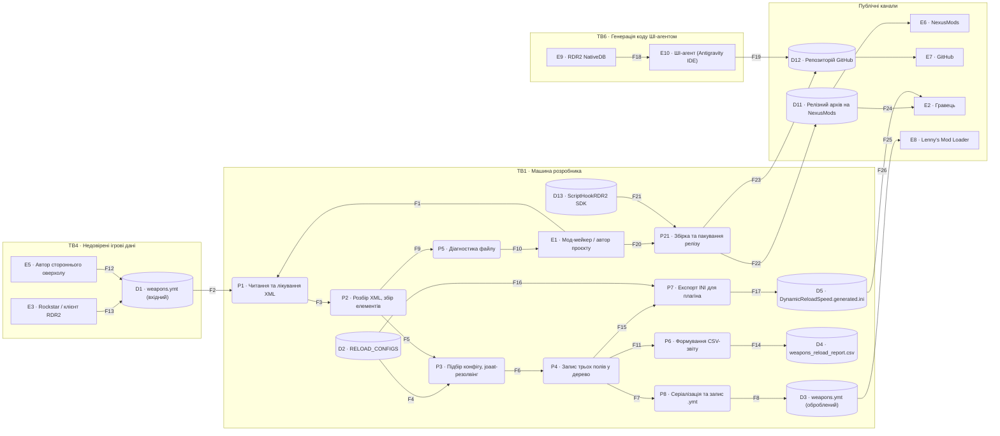
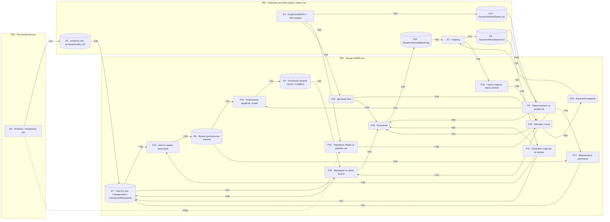

# Діаграма потоків даних — RDR2 Dynamic Reload

| | |
| --- | --- |
| Назва | Діаграма потоків даних — RDR2 Dynamic Reload |
| Версія | 0.2.1 |
| Статус | Draft |
| Останнє оновлення | 2026-09-29 |
| Власник | Данило Перепеляк |
| Пов'язані документи | [`architecture.md`](architecture.md), [`../specification/requirements.md`](../specification/requirements.md), [`../internal_spec/AsiPlugin/business_logic.md`](../internal_spec/AsiPlugin/business_logic.md), [`../specification/glossary.md`](../specification/glossary.md) |

## 1. Призначення та нотація

Документ фіксує повну модель потоків даних системи: зовнішні суб'єкти, процеси, сховища даних, потоки між ними та межі довіри. Модель побудована так, щоб на її основі можна було виконати аналіз загроз за методикою STRIDE: кожен елемент має стабільний ідентифікатор, кожен потік — джерело, приймач і зміст, кожна межа довіри — явний перелік потоків, що її перетинають.

| Позначення | Тип елемента | Форма на діаграмі |
|---|---|---|
| `E` | Зовнішній суб'єкт (external entity) — поза контролем системи | Прямокутник |
| `P` | Процес (process) — перетворення даних усередині системи | Скруглений прямокутник |
| `D` | Сховище даних (data store) — файл, таблиця в коді або область пам'яті | Циліндр |
| `F` | Потік даних (data flow) | Стрілка |
| `TB` | Межа довіри (trust boundary) | Зона діаграми та окрема таблиця |

Модель поділена на два контури, які не мають прямих потоків між собою: **офлайн-контур** (препроцесор, збірка, постачання) і **рантайм-контур** (плагін усередині процесу гри). Єдиний зв'язок між ними — файли, які переносить людина: `DynamicReloadSpeed.generated.ini` та оброблений `weapons.ymt`.

## 2. Діаграма: офлайн-контур

## 3. Діаграма: рантайм-контур

## 4. Зовнішні суб'єкти

| ID | Суб'єкт | Роль | Рівень довіри |
|---|---|---|---|
| E1 | Мод-мейкер / автор проєкту | Запускає препроцесор, готує конфіги, збирає й публікує реліз | Довірений у межах власної машини |
| E2 | Гравець | Встановлює архів, редагує INI, натискає гарячі клавіші, читає лог | Недовірений щодо вмісту INI, довірений щодо власної машини |
| E3 | Rockstar Games / клієнт RDR2 | Постачає бінарник гри та ванільний `weapons.ymt`; випускає оновлення, що змінюють розкладку структур | Зовнішній, некерований |
| E4 | ScriptHookRDR2 (рантайм і ASI-лоадер `dinput8.dll`) | Завантажує `.asi` у процес, надає нативи та обробник клавіатури. Номер збірки гри від нього **не** береться — див. F35a | Довірений за фактом виконання в тому самому процесі; версія не контролюється проєктом |
| E5 | Автор стороннього оверхолу зброї | Джерело чужого або злитого `weapons.ymt` | Недовірений |
| E6 | NexusMods | Майданчик розповсюдження релізного архіву | Зовнішній, некерований |
| E7 | GitHub | Хостинг репозиторію з кодом і документацією | Зовнішній, некерований |
| E8 | Lenny's Mod Loader | Опційний засіб встановлення обробленого `weapons.ymt` у гравця | Зовнішній, необов'язковий |
| E9 | RDR2 NativeDB | Довідник для підтвердження нативів на етапі розробки | Зовнішній, довідковий |
| E10 | ШІ-агент розробки (Antigravity IDE) | Пише код за специфікацією під контролем розробника | Недовірений до перевірки людиною |

## 5. Процеси

| ID | Процес | Компонент | Вхідні потоки | Вихідні потоки |
|---|---|---|---|---|
| P1 | Читання файлу та лікування XML: BOM, теги з цифри, голі `&` | `ymt-tweaker` | F1, F2 | F3 |
| P2 | Розбір XML, збір `CWeaponInfo` та `CSectionedReloadInfo` | `ymt-tweaker` | F3 | F5, F9 |
| P3 | Підбір конфігу за іменем, резолвінг joaat-імен профілів | `ymt-tweaker` | F4, F5 | F6 |
| P4 | Запис трьох полів у вузли дерева | `ymt-tweaker` | F6 | F7, F11, F15 |
| P5 | Діагностика: дублікати, профілі без конфігу, повторна обробка | `ymt-tweaker` | F9 | F10 |
| P6 | Формування CSV-звіту | `ymt-tweaker` | F11 | F14 |
| P7 | Експорт INI для плагіна | `ymt-tweaker` | F15, F16 | F17 |
| P8 | Серіалізація дерева, відновлення імен тегів, запис `.ymt` | `ymt-tweaker` | F7 | F8 |
| P9 | Завантаження та розбір INI, значення за замовчуванням | `asi` / `Config` | F30, F32 | F33, F56 |
| P10 | Перевірка збірки гри та виявлення мережевої сесії | `asi` / `Script` | F35, F35a | F36 |
| P11 | Пошук цілей за joaat-хешем, консенсус офсета, побудова мап `hash → структура` | `asi` / `MemScan` | F34 | F37, F38, F55 |
| P12 | Зняття знімка трьох оригінальних значень | `asi` / `WeaponPatcher` | F38, F39 | F40 |
| P13 | Розв'язання джерел профілів, фолбеки, кламп | `asi` / `Config` | F33, F41 | F42 |
| P14 | Опитування сигналів бою, зведене рішення | `asi` / `CombatDetector` | F43 | F44, F54 |
| P15 | Автомат станів `CALM / COMBAT / COOLDOWN` | `asi` / `Script` | F36, F44, F59 | F45, F49, F52, F60 |
| P16 | Валідація адреси й поточного значення, запис трьох float | `asi` / `WeaponPatcher` | F45, F46, F47 | F48, F53 |
| P17 | Відновлення оригінальних значень зі знімка | `asi` / `WeaponPatcher` | F49, F50 | F51 |
| P18 | Логування з позначками часу та рівнями | `asi` / `Logger` | F52 – F56 | F57 |
| P19 | Приймання натискань, постановка запиту в чергу скрипт-потоку | `asi` / `main` + `Script` | F58 | F59 |
| P20 | Екранне відображення стану та версії | `asi` / `Overlay` | F60 | F61 |
| P21 | Збірка плагіна та пакування релізного архіву | `репозиторій` (процес рівня проєкту, не модуль коду) | F20, F21 | F22, F23 |

## 6. Сховища даних

| ID | Сховище | Носій | Хто пише | Хто читає | Примітка щодо довіри |
|---|---|---|---|---|---|
| D1 | `weapons.ymt` (вхідний) | Файл на машині розробника | E3, E5, E1 | P1 | Недовірений вхід: чужі або злиті дані, можливі дублікати, зламаний XML |
| D2 | `RELOAD_CONFIGS` — таблиця калібрування | Код препроцесора | E1 | P3, P7 | Довірене джерело значень мирного профілю |
| D3 | `weapons.ymt` (оброблений) | Файл; у гравця — встановлений у грі | P8 | Гра при завантаженні | Впливає на знімок, який бачить плагін |
| D4 | `weapons_reload_report.csv` | Файл | P6 | E1 | Звіт, не впливає на поведінку системи |
| D5 | `DynamicReloadSpeed.generated.ini` | Файл | P7 | E1, E2 | Заготовка робочого конфігу; переноситься вручну |
| D6 | `DynamicReloadSpeed.ini` | Файл у корені гри | E2, E1 | P9, P11 | **Критичний елемент:** містить не лише значення профілів, а й параметри резолвінгу (вікно офсетів, поріг консенсусу) та список підтримуваних збірок, тобто впливає на те, за якими адресами плагін пише в пам'ять процесу. Абсолютних адрес і баз не містить за конструкцією (AD-02) |
| D7 | Пам'ять процесу гри: `CWeaponInfo`, `CSectionedReloadInfo` | Оперативна пам'ять `RDR2.exe` | Гра, P16, P17 | P11, P12, P16 | Глобальні дані гри, спільні для гравця й NPC; будь-який запис діє на всю гру |
| D8 | Знімок оригінальних значень | Пам'ять плагіна | P12 | P13, P17 | Іммутабельний після ініціалізації; єдине джерело відновлення |
| D9 | Розв'язані профілі `CALM` / `COMBAT` | Пам'ять плагіна | P13 | P16 | Оновлюється лише при перечитуванні конфігу |
| D10 | `DynamicReloadSpeed.log` | Файл у корені гри | P18 | E1, E2 | Єдиний дозволений запис плагіна на диск |
| D11 | Релізний архів на NexusMods | Файл на сторонньому майданчику | P21 | E2, E6 | Точка розповсюдження; цілісність поза контролем проєкту |
| D12 | Репозиторій GitHub | Сторонній хостинг | P21, E10 | E1, E7 | Містить код, документацію, історію змін |
| D13 | ScriptHookRDR2 SDK (`inc/`, `ScriptHookRDR2.lib`) | Файли на машині розробника | E1 (завантажує) | P21 | У репозиторій не потрапляє; версія фіксується в README |
| D14 | `DynamicReloadSpeed.asi` | Файл у корені гри | E2 (розпаковує) | E4 | Завантажується ASI-лоадером у процес гри |

## 7. Потоки даних

### 7.1 Офлайн-контур

| ID | Джерело → Приймач | Зміст | Перетинає межу |
|---|---|---|---|
| F1 | E1 → P1 | Шлях вхідного й вихідного файлів, прапорці `--report-only`, `--ini`, `--csv`, `--no-ini`, `--no-csv` | — |
| F2 | D1 → P1 | Текст метафайлу, до 88 000 рядків | TB4 |
| F3 | P1 → P2 | «Вилікуваний» текст, придатний для стандартного парсера | — |
| F4 | D2 → P3 | Цільові значення трьох полів та аліаси профілів | — |
| F5 | P2 → P3 | Елементи `CWeaponInfo` і `CSectionedReloadInfo` з іменами | — |
| F6 | P3 → P4 | Пара «вузол дерева — цільове значення» | — |
| F7 | P4 → P8 | Змінене дерево елементів | — |
| F8 | P8 → D3 | Вихідний `.ymt` з відновленими іменами тегів | — |
| F9 | P2 → P5 | Перелік імен, дублікатів, профілів без конфігу | — |
| F10 | P5 → E1 | Діагностичні повідомлення у консоль | — |
| F11 | P4 → P6 | Рядки звіту: старе значення, нове значення, статус | — |
| F12 | E5 → D1 | Сторонній або злитий `weapons.ymt` | TB4 |
| F13 | E3 → D1 | Ванільний `weapons.ymt` з поставки гри | TB4, TB5 |
| F14 | P6 → D4 | CSV-звіт | — |
| F15 | P4 → P7 | Значення, знайдені у вхідному файлі (`Combat_*`) | — |
| F16 | D2 → P7 | Значення таблиці калібрування (`Calm_*`) | — |
| F17 | P7 → D5 | Згенерований INI | — |
| F18 | E9 → E10 | Підтверджені імена, хеші та сигнатури нативів | TB6 |
| F19 | E10 → D12 | Згенерований код і документація | TB6 |
| F20 | E1 → P21 | Вихідний код, INI за замовчуванням, пресети, документація | — |
| F21 | D13 → P21 | Заголовки та бібліотека імпорту SDK | TB1 |
| F22 | P21 → D11 | Релізний архів: `.asi`, `.ini`, `README.txt`, `presets/` | TB1 |
| F23 | P21 → D12 | Код, документація, теги релізів | TB1 |
| F24 | D11 → E2 | Завантажений архів | TB1 |
| F25 | D3 → E8 | Оброблений `.ymt` для встановлення в гру | TB1 |
| F26 | D5 → E2 | Згенерований конфіг як заготовка робочого INI | TB1 |

### 7.2 Рантайм-контур

| ID | Джерело → Приймач | Зміст | Перетинає межу |
|---|---|---|---|
| F27 | E3 → D3 | Ванільні дані гри або оновлена версія гри, що змінює розкладку структур | TB5 |
| F28 | D3 → D7 | Розбір метафайлу грою під час завантаження, один раз | TB3 |
| F29 | E4 → D14 | Завантаження `.asi` у простір процесу | TB2, TB3 |
| F30 | D14 → P9 | Старт плагіна, читання шляху конфігу поруч із DLL | — |
| F31 | E2 → D6 | Ручне редагування INI: значення профілів, пресет, `[Memory]`, список збірок | TB2 |
| F32 | D6 → P9 | Текст конфігу | TB2 |
| F33 | P9 → P13 | Розібрані значення, джерела профілів, межі `MinValue` / `MaxValue` | — |
| F34 | D6 → P11 | Параметри пошуку: вікно офсетів, крок, поріг консенсусу, ліміт сканування | TB2 |
| F35 | E4 → P10 | Ознаки мережевої сесії | — |
| F35a | E3 (образ `RDR2.exe` у процесі) → P10 | Номер збірки гри з ресурсу `VS_VERSIONINFO`. Окремий потік від F35 саме тому, що джерело інше: читання образу самої гри, а не виклик до ScriptHookRDR2 | — |
| F36 | P10 → P15 | Дозвіл або заборона працювати | — |
| F37 | P11 → D7 | Читання байтів пам'яті процесу під час резолвінгу | — |
| F38 | P11 → P12 | Адреси трьох полів для кожного зрезолвленого стволу | — |
| F39 | D7 → P12 | Оригінальні значення, завантажені грою | — |
| F40 | P12 → D8 | Знімок трьох значень на ствол | — |
| F41 | D8 → P13 | Базові значення для джерел `snapshot` і `multiplier` | — |
| F42 | P13 → D9 | Розв'язані та обмежені профілі `CALM` і `COMBAT` | — |
| F43 | E4 → P14 | Результати нативів: стрільба, ближній бій, шкода, стан ворожих педів, розшук, Dead Eye | — |
| F44 | P14 → P15 | Зведене рішення «бій / не бій» із переліком істинних сигналів | — |
| F45 | P15 → P16 | Команда застосувати профіль, пов'язана з переходом стану | — |
| F46 | D9 → P16 | Значення обраного профілю | — |
| F47 | D7 → P16 | Контрольне читання поточного значення перед записом | — |
| F48 | P16 → D7 | Запис трьох float-значень | TB3 |
| F49 | P15 → P17 | Команда відновлення: вимкнення, вивантаження, фатальна помилка | — |
| F50 | D8 → P17 | Оригінальні значення зі знімка | — |
| F51 | P17 → D7 | Запис оригінальних значень назад у структури гри | TB3 |
| F52 | P15 → P18 | Переходи станів із обома наборами значень | — |
| F53 | P16 → P18 | Результат валідації, факт запису, спрацювання клампа, відмова по стволу | — |
| F54 | P14 → P18 | Стан кожного сигналу з його тегом | — |
| F55 | P11 → P18 | Знайдені адреси, кількість зрезолвлених стволів, відмови резолвінгу | — |
| F56 | P9 → P18 | Прочитані ключі, застосовані значення за замовчуванням, помилки розбору | — |
| F57 | P18 → D10 | Рядки лога з позначками часу | TB2, TB3 |
| F58 | E2 → P19 | Натискання `HotkeyToggleMod`, `HotkeyForceCombat`, `HotkeyReloadConfig` | TB2 |
| F59 | P19 → P15 | Запит із черги, виконуваний у скрипт-потоці | — |
| F60 | P15 → P20 | Поточний стан і версія плагіна | — |
| F61 | P20 → E2 | Екранний індикатор | — |
| F62 | D10 → E2 | Лог для самодіагностики та звернень у підтримку | TB2 |

## 8. Межі довіри

| ID | Межа | Що розділяє | Потоки, що перетинають | Припущення, які втрачають силу на цій межі |
|---|---|---|---|---|
| TB1 | Машина розробника ↔ публічні канали | Робоче середовище автора від NexusMods, GitHub і машин гравців | F21 – F26 | Цілісність артефакту після публікації; відповідність того, що завантажив гравець, тому, що зібрав автор |
| TB2 | Файлова система гравця ↔ процес гри | Файли в корені гри (`.asi`, `.ini`, `.log`) від коду, що виконується в процесі | F29, F31, F32, F34, F57, F58, F62 | Вміст INI контролює користувач або будь-який процес із правами запису в теку гри; плагін не може вважати ці дані коректними |
| TB3 | Межа процесу `RDR2.exe` | Код плагіна від коду й даних гри | F28, F29, F48, F51, F57 | Ізоляції немає: плагін виконується з правами гри й пише у її глобальні дані; помилка тут дорівнює помилці гри |
| TB4 | Довіра до ігрових даних | Власні дані від чужих і злитих `weapons.ymt` | F2, F12, F13 | Коректність XML, унікальність імен, узгодженість значень у дублікатах |
| TB5 | Постачальник гри | Проєкт від оновлень Rockstar | F13, F27 | Дійсність розкладки структур, переліку стволів і номера збірки |
| TB6 | Генерація коду ШІ-агентом | Код, створений агентом, від коду, перевіреного людиною | F18, F19 | Існування нативів і коректність офсетів, поки їх не підтверджено в NativeDB і не зафіксовано в `docs/NATIVES.md` |

**Потік `F35a` не перетинає жодної межі довіри** і тому не фігурує в жодному з шести переліків вище. Номер збірки читається з ресурсу `VS_VERSIONINFO` образу `RDR2.exe`, який на момент читання вже завантажений у той самий процес, тож потік лишається всередині TB3. Пунктир на діаграмі §3 позначає саме це: джерело потоку — образ гри в процесі, а не зовнішній суб'єкт за межею TB5.

## 9. Точки підвищеної уваги для моделювання загроз

| Елемент | Чому критичний |
|---|---|
| D6 (`DynamicReloadSpeed.ini`) | Єдиний вхід, що впливає на адреси запису в пам'ять чужого процесу: вікно офсетів, поріг консенсусу, список підтримуваних збірок. Редагується користувачем і доступний будь-кому, хто має запис у теку гри. Базу цілі задати не може — вона здобувається резолвінгом |
| F34, F48 | Ланцюг «офсет із текстового файлу → запис у пам'ять». Пом'якшується FR-35 (перевірка вказівника, вирівнювання, закомміченої області, діапазону поточного значення) та FR-36 (збіг зі знімком перед першим записом) |
| D7 (пам'ять гри) | Глобальні дані: зміна діє на гравця і на всіх NPC; некоректний запис здатний зруйнувати стан гри |
| D8 (знімок) | Якщо знімок неповний або оновлений помилково, відновлення перестає бути відновленням (FR-57) |
| D1 (вхідний `weapons.ymt`) | Недовірений вхід препроцесора: розмір близько 88 000 рядків, зламаний XML, дублікати, хешовані імена |
| D11 (релізний архів) | Канал постачання: гравець отримує виконуваний код через сторонній майданчик |
| E4 (ScriptHookRDR2 та ASI-лоадер) | Завантажує плагін у процес і постачає всі дані про стан гри; його компрометація робить будь-який контроль усередині плагіна беззмістовним |
| E10 (ШІ-агент) | Джерело коду, здатне згенерувати виклик неіснуючого натива або хибний офсет, що компілюється й мовчки не працює |

## 10. Довірчі допущення моделі

- Операційна система, файлова система гравця й сам бінарник гри вважаються некомпрометованими; загрози рівня «зловмисник уже має права адміністратора на машині гравця» поза межами моделі.
- ScriptHookRDR2 вважається автентичним: плагін не перевіряє й не може перевірити цілісність лоадера, усередині якого виконується.
- Цілісність архіву **в межах майданчика** NexusMods забезпечується самим майданчиком; поза ним — не забезпечується нічим. Проєкт не підписує артефакти й покладається на опубліковані контрольні суми як на єдиний спосіб самостійної звірки з боку гравця.
- Модель описує лише одиночну гру: у разі виявлення мережевої сесії плагін не виконує жодних записів, тож відповідних потоків у моделі немає.
